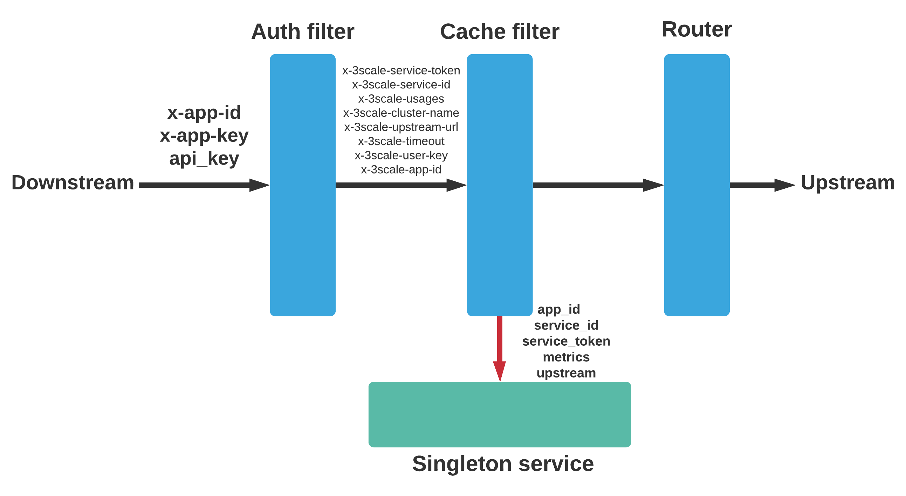

<!-- PROJECT LOGO -->
<br />
<p align="center">
  <a href="https://www.3scale.net/">
    
  </a>

  <h3 align="center">3scale envoy proxy authorization cache</h3>

  <p align="center">
    GSoC 2021
    <br />
    <a href="#"><strong>Explore the docs »</strong></a>
    <br />
    <br />
    <a href="#">View Demo</a>
    ·
    <a href="#">Report Bug</a>
    ·
    <a href="#">Request Feature</a>
  </p>
</p>

<!-- TABLE OF CONTENTS -->
## Table of Contents

* [About the Project](#about-the-project)
* [High level architecture overview](#high-level-architecture-overview)
* [Prerequisites](#prerequisites)
* [Installation](#installation)
* [Integration tests](#writing-integration-tests)
* [Additional features](#additional-features)
* [Roadmap](#roadmap)
* [Contributing](#contributing)
* [License](#license)


<!-- ABOUT THE PROJECT -->
## About The Project

The project is done as a part of Google Summer of Code 2021 programme. The main intention of the project is to 
implement an in-proxy authorization cache for envoy proxy which performs authorization and rate limiting based on
the in-proxy cache reducing the request latency. Also, it will reduce the traffic on the threescale service management API by
synchronizing with the service management API based on various policies defined instead of making 1 HTTP call per request.

## High level architecture overview



Above diagram shows the request flow through the filter chain inside envoy proxy. There are 3 main components in the diagram. (without the http router)

### Auth filter

The request is first intercepted by the `threescale-wasm-auth` filter. In it's usual operation, it will make an `authrep` call to 3scale SM API.
But in this case, auth filter is used in its passthrough mode. In the passthrough mode, auth filter will just pass the 3scale metadata to the next 
filter in the filter chain which is the cache filter. The following metadata values are passed to the cache filter under the current implementation.

* Service token
* Service ID
* Usages
* Cluster name
* Upstream URL
* Timeout
* Userkey/AppID/AppKey

### Cache filter

The main functionality of the cache filter is to process the request using the cache data stored in the proxy. Depending on the availability of cache data
for a particular combination of Service ID and App ID, two scenarios are possible.
1. Cache hit - A cache record for the combination of Service ID and App ID exist in the cache.
2. Cache miss - No cache record for the combination of Service ID and App ID.

In case of a cache miss, cache filter will perform an authorize request to fetch the application data from the 3scale SM API and will pause the request processing untill a response arives. Depending on the response, it will process the request further or send a direct response to the client. eg: 401 in case of unauthorized.

In case of a cache hit, cache filter will process the request based on the stored cache data for that application.

In both cases after handling cache miss or cache hit, cache filter will try to update the usages stored in the cache. If the usage update fails due to concurrency 
issues, then the cache filter will delegate that task to the singleton service. Even when the usage update is successful, cache filter has to send the request metadata to the singleton service for reporting purposes.

Cache filter executes in the worker threads. Refer the [cache-filter-documentation](docs/CACHE.md) for a more detailed explaination about the cache filter.

### Singleton service

Singleton service has 2 main functionalities.

1. Flush the usages to the 3scale SM API using report requests.
2. Update the in-proxy cache by sending authorize requests to the 3scale SM API.

Singleton service executes in the main thread and executes independantly of the request lifecycle.

Refer the [singleton-service-documentation](docs/SINGLETON.md) for a more detailed explaination about the singleton service.

## Prerequisites

###  Build Prerequisites for filters and singleton service
* Rust
* Cargo
* Make

### Prerequisites for integration tests
* Golang
* Docker
* Docker Compose

## Installation
 
1. Clone the repo 
```sh
git clone https://github.com/3scale-labs/gsoc-wasm-filters.git
cd gsoc-wasm-filters
```
2. Build the project

> Building the cache filter, singleton service and threescale auth filter.

* Development build
```sh
make build
```
* Production build
> For the release build `wasm-opt` and `wasm-snip` are required as the auth filter requires them for build optimizations. 
```sh
make build BUILD=release
```
* Building individual components

Individual components can be built using the following make commands.

```sh
make cache
make service
make auth
```
Build artifacts for the release can be built by passing `BUILD=release` to the individual commands. After a successful build, 
build artifacts generated will get placed in the deployments/docker-compose folder.

3. Run the integration tests.

For the integration tests, golang is required to be installed on the host.

> Please note that integration tests should be executed after a successful build when build artifacts are available in the `deployments/docker-compose folder`.

```sh
make integration
```

4. Start the services with docker-compose

```sh
make run
```

5. Send sample test requests for the following scenarios.

> Please note that the service id and service token related to the above tests are hard coded into `deployments/docker-compose/envoy.yaml`.

* Send a GET request with `app_id` and `app_key` pattern.

```sh
curl -X GET 'localhost:9095/' -H 'x-app-id: APP_ID' -H 'x-app-key: APP_KEY'
```

* Send a GET request with `user_key` pattern.

```sh
curl -X GET 'localhost:9095/?api_key=USER_KEY'
```

## Writing integration tests

Integration tests are written in golang and executed by starting related services in docker containers using docker-compose. 

In integration-tests directory,
* `main.go` contains helper method for generating custom config files, serial searching patterns through response headers, starting/stoping proxy and middleware service.
* `apisonator.go` contains helper methods for maintaining local state of Apisonator during tests.
* `middleware` directory contains source code of a service to add custom delay to the response from apisonator. Note: when using this service, you need to update `envoy.yaml` file to point to it and it will act as a proxy server in-between.

When running the integration tests, apisonator, redis instances and the mock backend will start first and will be running for the whole duration of the tests. For each test/test suite, a new proxy instance is created and added to the same docker network that apisonator and other containers are running. This can be done by using the `StartProxy(dockerfile string, envoy string)` method. If a new proxy instance is required for each test, then this method should be used inside a test case at the beginning or in the `BeforeTest()`. If a new proxy instance is required for each test suite, then `StartProxy(dockerfile string, envoy string)` should be used inside
`SetupSuite()` method. `StopProxy()` method can be used to stop the proxy instance after each test/ test suite.

> For all the tests, it is important to add a delay after container initialization and testing in order to provide time for services to be available when running inside hosts with less performance, CI/CD pipelines.

**Using testify suite**

For each group of related independant tests, a test suite can be created as follows.

```go
type ExampleTestSuite struct {
    suite.Suite
}
```

For each group, `SetupSuite` method can be used to implement suite initialization like starting services using docker-compose, application, service initialization etc.

```go
func (suite *AppCredentialTestSuite) SetupSuite() {
	// Initialization logic goes here
}
```

Also for advance testing if each test requires some initialization, `SetupTest()`, `BeforeTest()` can be used.
The test cases can be implemented by implementing a test func for each case.

```go
func (suite *ExampleTestSuite) TestExample() {
    // Test logic goes here
    assert.Equal(suite.T(), 123, 123)
}

```

Finally we can run a clean up function using `TearDownSuite()`. Here we can stop the services that runs in docker.

```go
func (suite *AppCredentialTestSuite) TearDownSuite() {
  // Clean up logic goes here
}
```
Also for advanced testing cases, `TearDownTest()` can be used to clean up after every test.

**Generating custom envoy configs**

`GenerateConfig` allows you to generate custom envoy.yaml files during the test time phase. It takes two params: 1) name of the file (e.g. `temp.yaml`) 2) JSON formated key-value pairs. These keys should match those present in the `config_template.yaml` file and will be replaced with the value provided.

```json
{ 
	"UpstreamURL": "\"http://dogecoin.net:3000\"",
}
```
will replace the following key in the config:
```yaml
....
"upstream":
  ....
  "url": {{or .UpstreamURL "\"localhost:3000\""}},
....
# Note: if 'UpstreamURL key is not provided, next value i.e "localhost:3000" will be used instead.
```
For a working example, that generates a custom config file and starts proxy using that, please refer to `config_test.go` file.

For making any changes to `config_template.yaml`, please refer to https://golang.org/pkg/text/template/

## Additional features

1. Integrating metrics and observability.

One of the primary goals of Envoy is to make the network understandable. Envoy emits a large number of statistics depending on how it is configured. Refer the [metrics-documentation](docs/METRICS.md) for a more detailed explaination about the project setup with metrics.
<!-- ROADMAP -->
## Roadmap

See the [open issues](https://github.com/3scale-labs/gsoc-wasm-filters/issues) for a list of proposed features (and known issues).


<!-- CONTRIBUTING -->
## Contributing

Contributions are what make the open source community such an amazing place to be learn, inspire, and create. Any contributions you make are **greatly appreciated**.

1. Fork the Project
2. Create your Feature Branch (`git checkout -b feature/AmazingFeature`)
3. Commit your Changes (`git commit -m 'Add some AmazingFeature'`)
4. Push to the Branch (`git push origin feature/AmazingFeature`)
5. Open a Pull Request

<!-- LICENSE -->
## License

Distributed under the Apache License Version 2.0. See `LICENSE` for more information.
