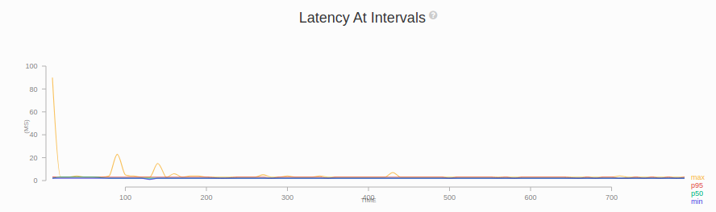
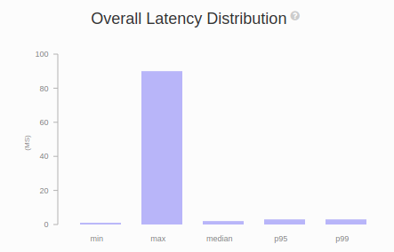
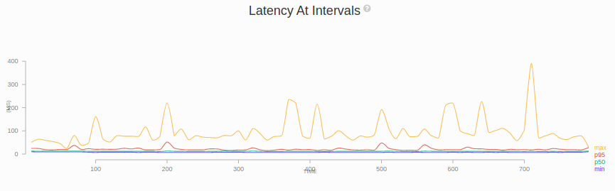
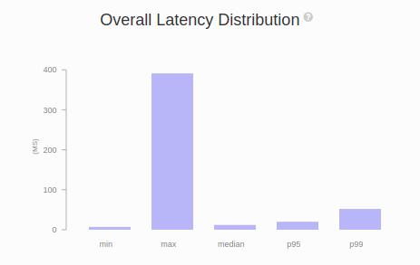
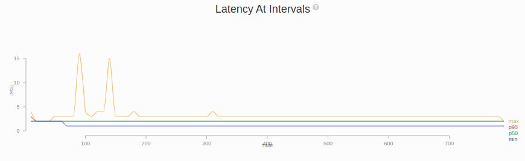
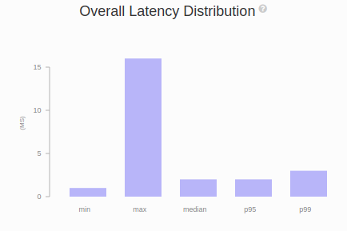

## Benchmarking proxy cache by considering latency.

### About

In this benchmark, 3 different proxy setups are used to compare and contrast the HTTP latencies.

1. Proxy with threescale auth filter, cache filter and singleton service. (Scenario 1)
    * In this case auth filter will just pass the 3scale keys to cache filter. In case of a cache miss, cache filter will perform an authorize request to the 3scale SM API and fetch the application. In case of a cache hit, cache filter will process the request with the cached data available.
2. Proxy with threescale auth filter. (Scenario 2)
    * In this case auth filter will make authrep requests to the 3scale SM API for every request from the client.
3. Proxy without any plugins (filters or services). (Scenario 3)
    * No plugins applied in this case.

### Specifications of the infrastructure used

| Instance | Machine type | Memory  |
| ------- |:-------------:| -----:|
| Proxy | m5a.2xlarge | 32G |
| Client | c5a.xlarge | 16G |
| Service | c5a.xlarge | 16G |

### Software and tooling

| Software | Version | 
| ------- |:-------------: |
| Envoyproxy | v1.18.2 |
| threescale-wasm-auth | 9ad206e4ce20be1c4b75d264a867b9e11acfc4af | 
| gsoc-wasm-filters | ce5547d40d0fbec1970115dd1ed3365b27a5c0b4 |
| Artillery | v1.7.6 |

* All host machines running Ubuntu 21.04 (GNU/Linux 5.11.0-1014-aws x86_64)

### Running the benchmark setup

> Note: Before running the benchmark setup with artillery, start the proxy and backend service. Also add relevant 3scale keys to envoy and artillery config files.

To run the benchmark setup,

```sh
artillery run artillery.yaml --output output.json
```

To generate the report,

```sh
artillery report output.json
```

### Benchmark results

#### Scenario 1 (auth+cache+singleton)

The following figure shows the variation of latencies during the benchmark time for Scenario 1.



**In the above figure, the sudden drop of the maximum latency at the begining represents the transition from cache miss to cache hit. The first request will cause a cache miss and the subsequent requests will process the requests using the cache reducing the latencies.**



Above figure shows the overall latency distribution for the Scenario 1. The big difference between the max latency and the other latencies are due to the fact that max latency get a high bias from the initial cache miss scenario which is comparatively large when compared with cache hit latencies.

#### Scenario 2 (auth only)

The following figure shows the variation of latencies during the benchmark time for Scenario 2.



In the above figure maximum latency shows a high variance when compared with scenario 1 max latency due to the external HTTP calls. In the scenario 2, for each request from client, an external HTTP call to 3scale SM API is performed. The latency for this external HTTP call depends on the external network latencies and it affects the max latency variation.



This scenario has the highest latencies when compared with other scenarios.

#### Scenario 3 (no plugins)

The following figure shows the variation of latencies during the benchmark time for Scenario 3.



Even in the above figure, max latency variation is less than the scenario 2 which again proves the effect of varying external HTTP request latency for scenario 2.
Out of the 3 scenarios, lowest latencies are present in this case.



#### Comaprison of latencies

> Note: All the latencies are in milli seconds.

| Scenario | Min | Max | Median | 95p | 99p |
| -------- | --- | --- | ------ | --- | --- |
| 1 | 1 | 90 | 2 | 3 | 3 |
| 2 | 7 | 391 | 12 | 20 | 52 |
| 3 | 1 | 16 | 2 | 2 | 3 |

From the above comparison, it is clear that lowest latencies are present for scenario 3 which is without plugins. And the next lowest latencies are for the scenario 1 which is the proxy cache scenario. Highest latencies are present in the scenario 2. Also the large difference of latencies between the scenario 1 and 2 shows that the cache implementation decreases the overall latencies significantly. Also the small difference between the scenario 1 and 3 shows that the extra latency and performance drop due to WASM plugins is very low or negligible.

All the reports for this benchmark can be found in the `reports/` folder.