# Unique callouts benchmark

In this benchmark, latencies between unique callout implementation using message queues and the current version without the unique callout feature is analysed and compared. Since the unique callout is applied only for the initial cache miss scenario, this benchmark focus more on the initial latency in first few seconds. For this benchmark load generating tool [hey](https://github.com/rakyll/hey) is used to generate the load and [hey-hdr](https://github.com/asoorm/hey-hdr) is used to generate the reports.

## Traffic profiles used

1. Regular traffic profile of 1000000 requests using concurrency level of 100.

```sh
hey -n 1000000 -c 100 -m GET -H "x-app-id: APP_ID" -H "x-app-key: APP_KEY" -o csv http://gsoc-int-envoy.dev.3sca.net:9095/ > result.csv
```

2. Sudden traffic spike for 2 seconds using conccurency level of 500.

```sh
hey -z 2s -c 500 -m GET -H "x-app-id: APP_ID" -H "x-app-key: APP_KEY" -o csv http://gsoc-int-envoy.dev.3sca.net:9095/ > result-spike.csv
```

To ensure the accuracy of the results, every benchmark is performed twice and their corresponding results are compared.

> Note: From this point onwards in this documentation cache is refered to the current version without the unique callouts feature.

## Specifications of the infrastructure used

| Instance | Machine type | Memory  |
| ------- |:-------------:| -----:|
| Proxy | m5a.2xlarge | 32G |
| Client | c5a.xlarge | 16G |
| Service | c5a.xlarge | 16G |

## Software and tooling

| Software | Version | 
| ------- |:-------------: |
| Envoyproxy | v1.18.2 |
| threescale-wasm-auth | 9ad206e4ce20be1c4b75d264a867b9e11acfc4af | 
| gsoc-wasm-filters/unique-callouts-mq | 7b14ac02022a15804398ecb38e1028cb58ab8409 |
| hey | 0.1.2-2 |

* All host machines running Ubuntu 21.04 (GNU/Linux 5.11.0-1014-aws x86_64)

## Regular traffic profile.

### Benchmark 1

**Latency by percentile distribution**

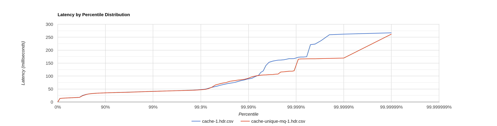

In the above diagram 99.9% of the latency are similar in both cases(low latencies after cache miss). But when the high latencies are considered (before cache miss), unique callouts setup is performing better as expected. Further details regarding the latencies are shown in the 2 scatter plots below.

**Cache scatter plot(without unique callouts)**


**Unique callouts scatter plot**

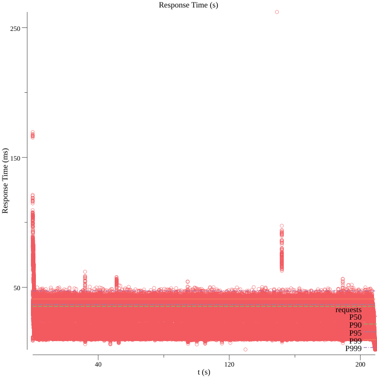

### Benchmark 2

**Latency by percentile distribution**

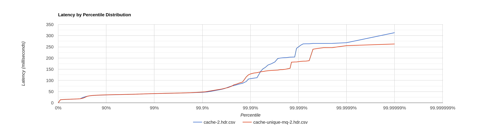

In the above diagram also 99% of the latency are similar in both cases(low latencies after cache miss). But when the high latencies are considered (before cache miss), unique callouts setup is performing better as expected. Further details regarding the latencies are shown in the 2 scatter plots below.

**Cache scatter plot(without unique callouts)**

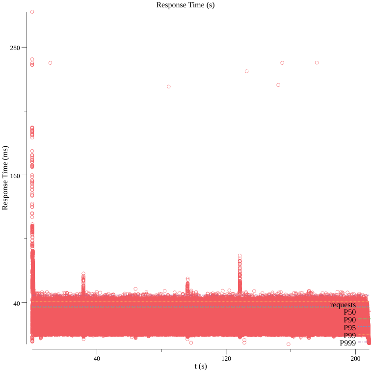

**Unique callouts scatter plot**

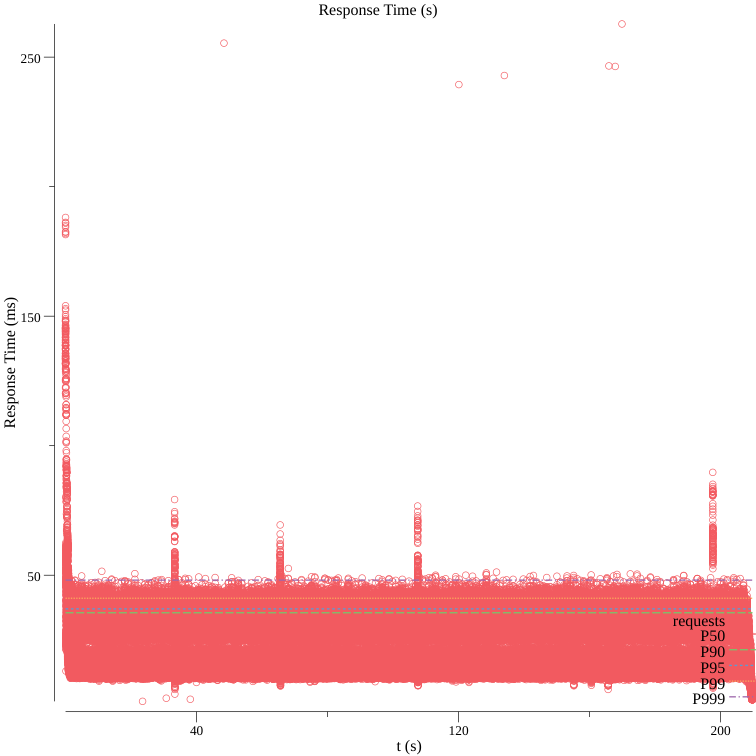

### Results of Benchmark1 and Benchmark2 combined

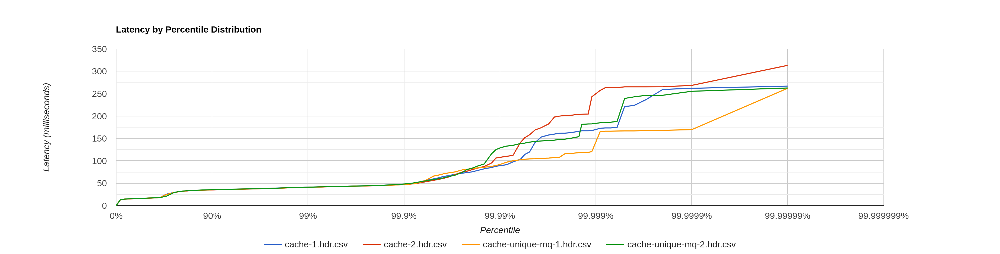

From the above diagram we can see that 99.9 % of the latencies are similar for both cache (without unique callouts) and unique callouts. Also cache-1 and cache-unique-mq-callout-2 have similar latencies in the rest 0.1 % also (before the cache miss). But when cache-2 is conisidered, maximum latencies of unqiue callouts is lesser than the cache-2. So by considering all we can say that unqiue callouts performs slightly better in the cache miss stage. This is further analysed in the next traffic profile by considering only a initial 2 second period under a sudden traffic spike.

## Spike traffic profile

In this benchmark we are sending sudden traffic spike for 2 seconds and then compare the latencies in that 2 seconds interval to evaluate the performance of the unique callouts feature.

### Benchmark 1

**Latency by percentile distribution**

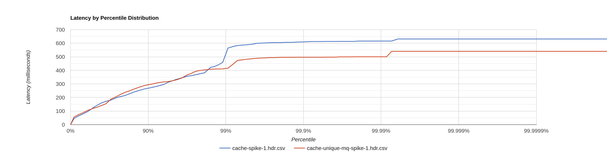

From the above diagram we can see that around 97% of latencies are similar(cache hits). But from the rest we can clearly see that unique callouts perform better. Further details regarding the latencies are shown in the 2 scatter plots below.

**Cache scatter plot(without unique callouts)**

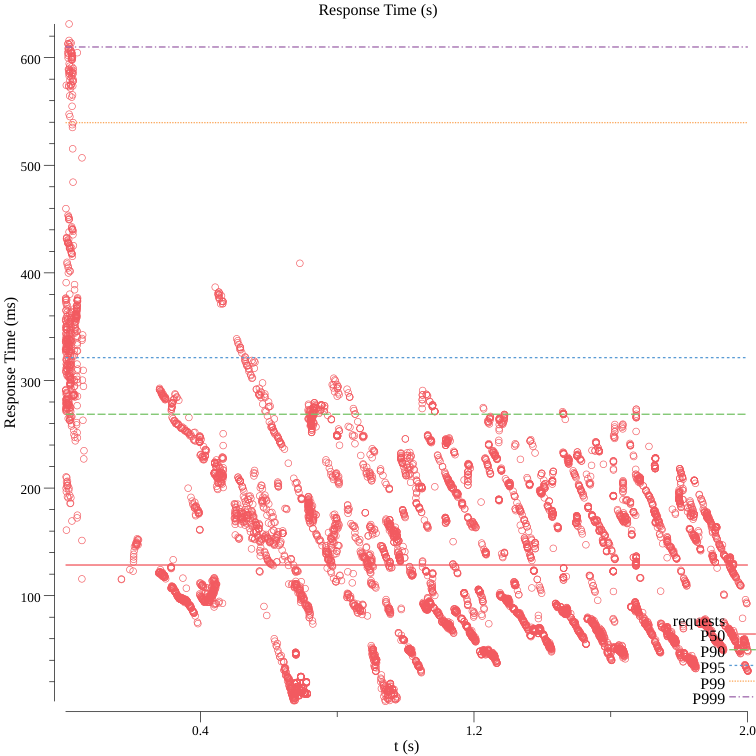

**Unique callouts scatter plot**

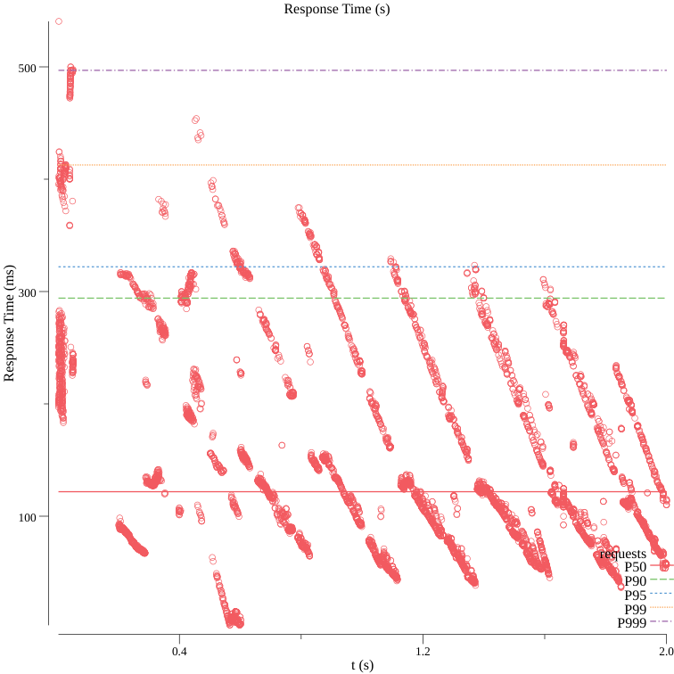

### Benchmark 2

**Latency by percentile distribution**

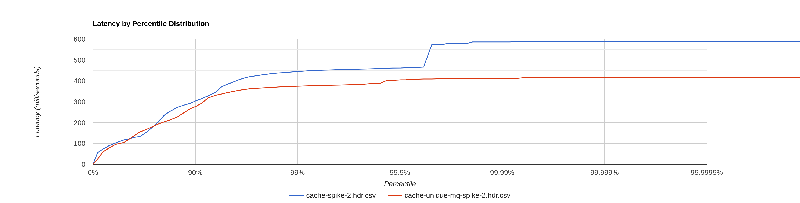

In the above diagram lower latencies are similar in both cases(low latencies after cache miss). But when the high latencies are considered (before cache miss), unique callouts setup is performing better as expected. Further details regarding the latencies are shown in the 2 scatter plots below.

**Cache scatter plot(without unique callouts)**

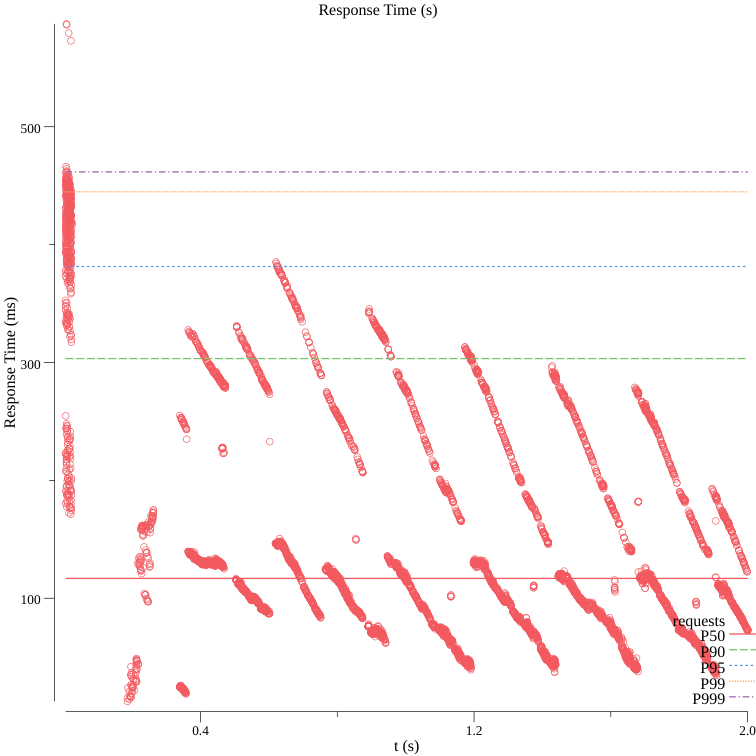

**Unique callouts scatter plot**

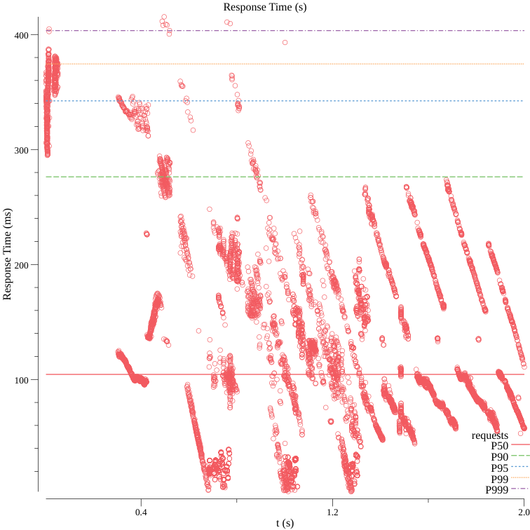

### Results of Benchmark1 and Benchmark2 combined

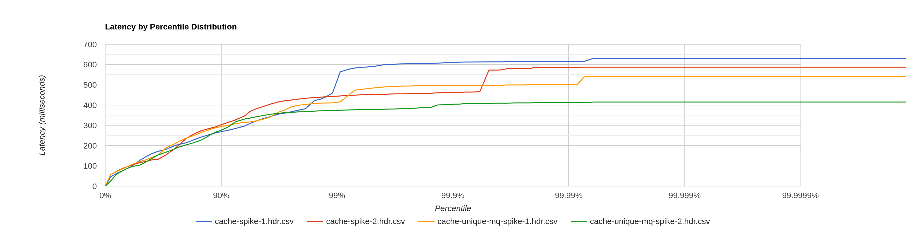

From the above diagram we can see that 99% of the latencies are similar for both cache (without unique callouts) and unique callouts. But when high latencies are considered unique callouts setup is performing better.

