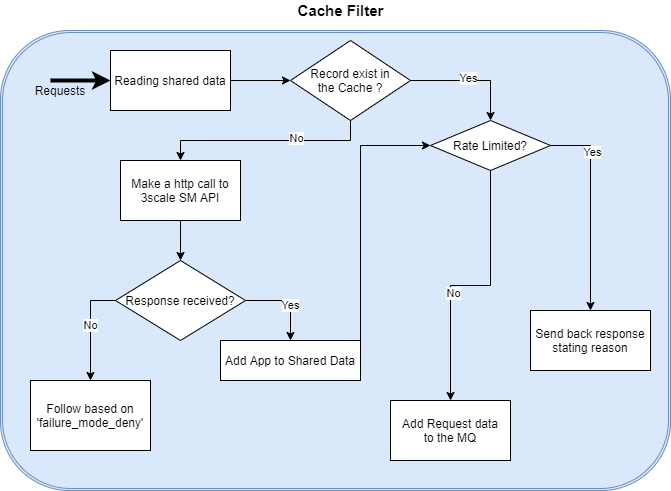

## Cache-filter Design
**Request requirements**

There are 5 incoming request requirements for cache-filter either from the previous filter ([threescale-wasm-auth](https://github.com/3scale/threescale-wasm-auth/)) in the chain or client making the call if it's being used as the first filter in the chain.

* Header `x-3scale-service-token`: It is required for authentication by SM API.

* Header `x-3scale-service-id`: It is used in cache and for authentication by SM API.

* Header `x-3scale-usages`: These are the metrics that the request is trying to consume. Format is list of `"metric": increaseByValue(e.g. 5)`

* Header `x-3scale-cluster-name`: It's the name of the cluster that deploys 3scale SM API.

* Header `x-3scale-upstream-url`: It's required to get authority info.

**Flow**



**Configuration option**

There are 3 configurable behaviours for the cache-filter:

* `failure_mode_deny` (boolean): If any unrecoverable error is encountered, what should proxy do? If set to true, it will deny them (which is also the default case), otherwise, it will allow them to proceed to next filter in the chain.

* `max_tries` (u32): How many times should a thread retry to write data to the shared data if failed due to CasMismatch. Default is 5.

* `max_shared_memory_bytes` (u64): How many memory (in bytes) should shared data be allowed to use before it starts evicting elements? Default is around 4GB (4294967296 bytes to be exact).

**visible-logs feature for testing**

This is a cargo feature added into the cache to get trace logs back in the header response of a request, which can be used to write integration tests. To enable this feature, build cache with:
```bash
make cache CACHE_EXTRA_ARGS=--all-features
# or
make build CACHE_EXTRA_ARGS=--all-features
```

> Note: Cache-filter rely on singleton service to batch and push reporting metrics to the 3scale SM API.
