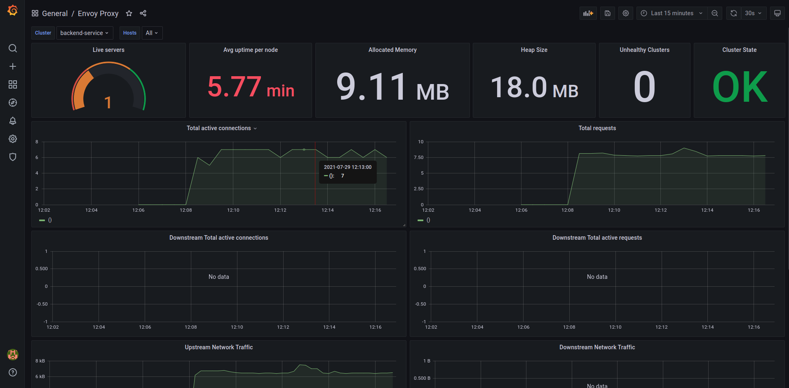

## Deployment setup with metrics and observability

In this setup, metrics and observability aspects of envoy proxy will be demonstrated using prometheus, grafana and jaeger.

### Envoy statistics

One of the primary goals of Envoy is to make the network understandable. Envoy emits a large number of statistics depending on how it is configured. Generally the statistics fall into three categories:

* Downstream: Downstream statistics relate to incoming connections/requests. They are emitted by listeners, the HTTP connection manager, the TCP proxy filter, etc.

* Upstream: Upstream statistics relate to outgoing connections/requests. They are emitted by connection pools, the router filter, the TCP proxy filter, etc.

* Server: Server statistics describe how the Envoy server instance is working. Statistics like server uptime or amount of allocated memory are categorized here.

Envoy has the ability to support custom, pluggable sinks like statsd, hystrix , dog_statsd etc. But for our scenario we are directly fetching the statistics using prometheus since envoy has out of the box prometheus integration.

In this setup, 5 services are used to demonstrate the metrics and observability aspects.

1. Envoy proxy instance that routes the requests to the back end service.
2. Mock backend service which sends the request information to the client.
3. Prometheus instance that pulls metrics from envoy.
4. Grafana dashboard instance that displays the metrics collected in prometheus.
5. Jaeger instance that collects zipkin traces and display tracing information.

### Running the setup

> Before running the setup, build the plugins using `make build`.

```sh
make run METRICS=true
```

Prometheus, Grafana and Jaeger dashboards can be accessed from the following urls.

* Prometheus - `localhost:9090`
* Grafana - `localhost:3001`
* Jaeger - `localhost:16686`

### Configuring grafana and importing a dashboard.

1. Go to `localhost:3001` and enter the username and password as admin.
2. Select add your first data source button.
3. Select Prometheus from the list.
4. In the URL enter `prometheus:9090` and click the `save & test` button at the bottom without changing anything.
5. Click the `+` button in the left side pane and choose `import` option.
6. Enter 6693 to import an already created grafana dashboard and click `load` button.
7. Select prometheus as the datasource from the drop down and click `import`.
8. If everything is working, you should see a dashboard like the following.



Next create some services, apps, metrics in the local apisonator using the internal API and send the requests. If everything is working you will be able to query prometheus for metrics, see the updates in the dashboard and traces in jaeger.
