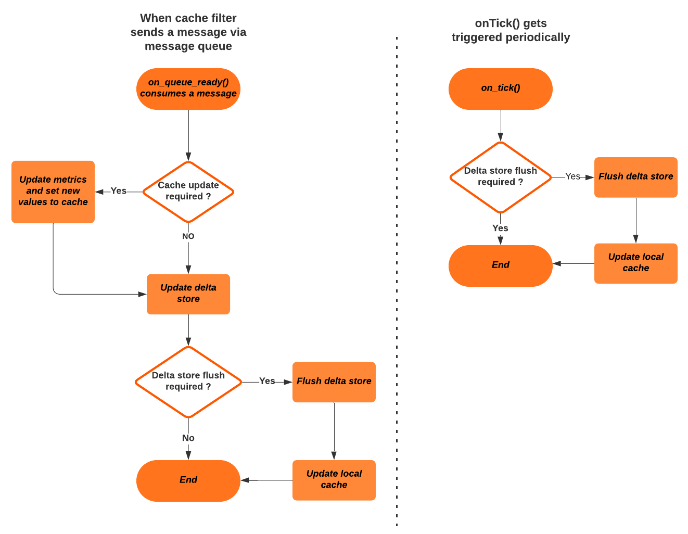

## Singleton service

### Execution flow

The following flow chart shows the execution flow happen in the singleton service when it receives a message from the cache filter via the message queue and the
execution flow when `on_tick()` gets triggered periodically.



## on_queue_ready() execution flow

In this scenario cache filter sends a message via the message queue and `on_queue_ready()` gets triggered on the singleton service. Then singleton service deques the 
message using `dequeue_shared_queue()` and process the message in the following order.

1. If cache update is required, then it will update the metric counters and set the new updated application to the cache. If cache update is not required it will proceed directly to the next step.
2. Updating the delta store according to the Service ID and App ID combination received. Here there are 4 possible cases.
    1. Service does not exit. Create a service, application and add usages to the application.
    2. Service exist, application does not exist. Create an application and add usage to the application. Add the application with usage to the already existing service.
    3. Service exist, application exist but the related metric does not exist. In this case add the related metric to the application and initialize the metric with the received value.
    4. Service exist, application exist, metric exist. Need only to update the value of the metric.
3. If delta store flush is required, then flush the deltas as report requests. (one report request per service)
4. Update the in-proxy cache using the response from the authorize requests. (one authorize request per application)

## on_tick() execution flow

In this scenario if the user configures the flush mode as `Default` or `Periodical`, delta store flush and local cache update will happen when on_tick() gets triggered.

## Singleton configuration

Following values can be configured for the singleton service. If user doesn't provide a configuration, then the default configuration will be considered.

* `capacity` - Capacity of the delta store. Memory consumption of the associated hashmap keys are considered here without the dynamic allocation. Default - 100.
* `periodical_flush` - Represents the time interval for the periodical flush if the flush mode is enabled as `periodical`. Default - 60s. 
* `retry_duration` - Represents the retry duration when a network failure happens (not yet implemented). Default - 30s
* `await_queue_capacity` - Represents the queue capacity for temporary storing the reports in case of a network failure (not yet implemented). Default - 200.
* `flush_mode` - Represents the method of flushing. Possible values - `ContainerLimit`, `Periodical` and `Default`.

**Sample configuration**

```yaml
bootstrap_extensions:
- name: envoy.bootstrap.wasm
  typed_config:
    '@type': type.googleapis.com/envoy.extensions.wasm.v3.WasmService
    singleton: true
    config:
      name: "singleton_service"
      root_id: "singleton_service"
      configuration: 
        "@type": type.googleapis.com/google.protobuf.StringValue
        value: |
          {
            "delta_store_config": {
              "capacity": 100,
              "periodical_flush": "60s",
              "retry_duration": "30s",
              "await_queue_capacity": 200,
              "flush_mode": "ContainerLimit"
            }
          }
      vm_config:
        runtime: "envoy.wasm.runtime.v8"
        vm_id: "my_vm_id"
        code:
          local:
            filename: "/usr/local/bin/singleton_service.wasm"
        configuration: {}
        allow_precompiled: true
```


